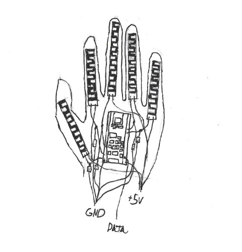

# Biosignal Kinematics Mapping

## Introduction
   This project is the R&D process of a tool that is attached to the user's hand, arm, and scalp in a minimally invasive way. This started as an idea for simply a glove and evolved (or devolved, depending on who you ask) into a full blown sleve. The outputs from this smorgasbord of sensors get dumped into a program to interpret them in what I hope to be real time (<250ms). There are a few forms this data analysis could be structured into such as a live 3d model, or CSV of quaternions (a number system I will talk about later). This project could be useful in a number of situations, from robotics control, to computer inputs, or as a gesture-to-speech system.

## Hand
   Starting with the part of this project that is both the easiest to make with limited resources, and is arguably the most important, the glove sensors. The important things to balance in the hand is having it be light, minimally invasive, and **accurate**, as well as, quite frankly, being cheap. Because of this I am designing the glove around an arduino nano on the back of the hand, specifically one with an integrated IMU chipset (inertial measurement unit). This measures the acceleration and angular velocity of the hand, which can be interpreted to represent the exact orientation of the hand, as well as help to refine the position data of the hand. The rest of the glove is comprised of flex sensors, which run in strips down the back of the fingers to measure how bent they are. This will then be interpreted into finger positions for how closed each finger is.

   Not all of this can be analyzed on the nano, so it will act more as an organization point to send more formatted data

### Initial Hand Design

The most common causes of output drift in an IMU chipset are to the gyroscope, and are caused by heat and angular random walk (ARW) caused by high frequency noice. The first one can simply be solved by placing a small fan and/or heatsink, or alternatively heat shielding around the arduino. ARW can be negated by the fusion of sensors, so if gyroscope changes without change in magnetometer (or vice versa) the input may be voided. This does cause issues, such as if a magnet throws off the magnetometer then the hand is rendered useless. The flex sensors may shift from their initial mapping slowly over time, but this can be fixed with a simple calibration. Methods to test the accuracy may be installed, but recalibration is both more simple, and a better habit to have in place. Every sensor is susceptible to drift, but pairing sensors to create redundancies also allows for correction of any issue of this extent. Another benefit of having a greater number of contrasting sensors is it allows detection of a larger variety of things that can be implemented into the calculations.
